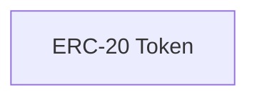

# My App

> A Web3 application composed with [N]skills.

**Network**: Arbitrum Sepolia (Chain ID: 421614) — Testnet
**Keywords**: 

---

## Architecture

## Components

| Component | Type | Category | User Prompt |
|-----------|------|----------|-------------|
| ERC-20 Token | `erc20-stylus` | contracts | (none) |

## Implementation Order

Build the project in this order (respects dependencies):

1. **ERC-20 Token** (`erc20-stylus`) — see `.nskills/components/erc20-stylus--8bc58ace.md`

## Environment Variables

| Key | Description | Required | Default |
|-----|-------------|----------|---------|
| `NEXT_PUBLIC_TOKEN_ADDRESS` | Deployed ERC20 token address | No |  |
| `PRIVATE_KEY` | Private key for deployment and transactions | Yes |  |
| `ERC20_DEPLOYMENT_API_URL` | URL of the ERC20 deployment API | No | http://localhost:4000 |

## Key Dependencies

| Package | Version |
|---------|---------|
| (none) | |

## Detailed Component Specs

- [ERC-20 Token](.nskills/components/erc20-stylus--8bc58ace.md)

## Additional Context

- [Project Configuration](.nskills/project.md)
- [Full Architecture Details](.nskills/architecture.md)
- [All Environment Variables](.nskills/environment.md)
- [Verified Dependencies](.nskills/dependencies.md)
- [Scripts Reference](.nskills/scripts.md)
- [Integration Map](.nskills/integration-map.md)

---

*Generated by [[N]skills](https://www.nskills.xyz) — Compose N skills for your Web3 project.*
